<!-- https://github.com/kyechan99/capsule-render -->

<!-- https://github.com/DenverCoder1/readme-typing-svg -->

<!-- https://github.com/anuraghazra/github-readme-stats -->

<!-- https://github.com/DenverCoder1/github-readme-streak-stats -->

 
<!-- https://github.com/Ashutosh00710/github-readme-activity-graph -->

 
<!-- https://github.com/anuraghazra/github-readme-stats -->

<!-- https://github.com/anuraghazra/github-readme-stats -->

 
<!-- https://github.com/tandpfun/skill-icons -->

<!-- https://github.com/kyechan99/capsule-render -->

